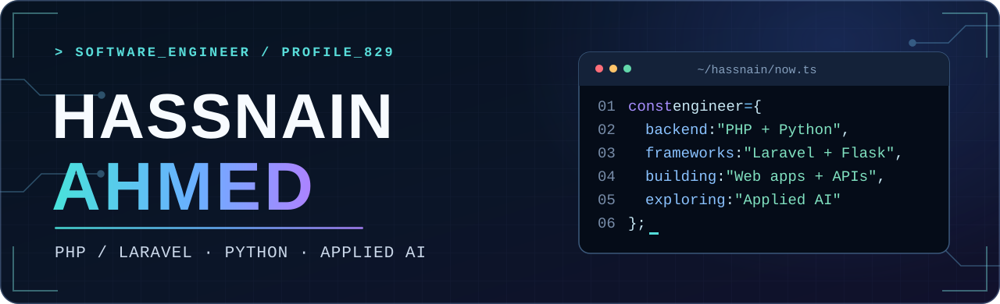

<p align="center">
  
</p>

<p align="center">
  <a href="https://www.linkedin.com/in/hassnain-ahmed-95b471362/"></a>
  <a href="https://github.com/Hassnain829?tab=repositories"></a>
</p>

<p align="center"><strong>Software Engineer</strong> &nbsp;·&nbsp; Karachi, Pakistan</p>

## About me

I'm a software engineer building web applications, APIs, automation, and practical AI tools. My work spans Laravel backends, Python automation, and user-facing interfaces. I develop a multi-store platform at **Resolute Digitals** and build **[AI Detriots](https://aidetriots.com/)** independently.

```text
Current focus  →  web applications + APIs + applied AI
Core stack     →  PHP · Laravel · Python · MySQL
```

## Featured work

<table>
  <tr>
    <td width="50%" valign="top">
      <h3><a href="https://aidetriots.com/">AI Detriots ↗</a></h3>
      <p>My voice-agent business for call handling, lead capture, follow-ups, and a customer dashboard.</p>
      <p></p>
    </td>
    <td width="50%" valign="top">
      <h3><a href="https://github.com/Hassnain829/G-Map-Scrapper-With-Linkedin-Enrichements-">Business lead discovery ↗</a></h3>
      <p>A local research pipeline that collects business listings, enriches contacts, tracks runs and duplicates, and exports results.</p>
      <p></p>
    </td>
  </tr>
  <tr>
    <td width="50%" valign="top">
      <h3><a href="https://github.com/Hassnain829/SaaS-ECommerce">Multi-store SaaS platform ↗</a></h3>
      <p>Ongoing Laravel platform for merchant catalogs, multi-location inventory, checkout, payments, shipping, and store-scoped permissions.</p>
      <p></p>
    </td>
    <td width="50%" valign="top">
      <h3><a href="https://github.com/Hassnain829/ML-Based-ChatBot">ML-based business chatbot ↗</a></h3>
      <p>Intent classifier trained on 1,364 example questions across 37 intents, with a Flask interface and prepared business responses.</p>
      <p></p>
    </td>
  </tr>
</table>

**Also exploring:** [Crypto trading research and paper trading](https://github.com/Hassnain829/Crypto-Trading-Agent) · [Search Fan-Out](https://github.com/Hassnain829/SEO_FAN_OUT_RANK) · [JamPsych LMS interface prototype](https://github.com/Hassnain829/JamPsych)

## Technology

<p align="center"><strong>Backend, data &amp; AI</strong></p>
<p align="center">
  
</p>

<p align="center"><strong>Interfaces &amp; tooling</strong></p>
<p align="center">
  
</p>

<p align="center"><sub>Also working with Playwright, scikit-learn, NLTK, Stripe Connect, FedEx APIs, Vapi, and n8n.</sub></p>

## Background

**PHP Developer** at Resolute Digitals · **Developer** at AlphaByte Solutions<br />
**Bachelor's in Artificial Intelligence** at Islamia University · **Diploma in Software Engineering** at Aptech

## Contribution trail

<p align="center">
  <picture>
    <source media="(prefers-color-scheme: dark)" srcset="https://raw.githubusercontent.com/Hassnain829/Hassnain829/output/github-snake-dark.svg" />
    <source media="(prefers-color-scheme: light)" srcset="https://raw.githubusercontent.com/Hassnain829/Hassnain829/output/github-snake.svg" />
    
  </picture>
</p>

<p align="center"><sub>Contribution animation powered by <a href="https://github.com/Platane/snk">Platane/snk</a>.</sub></p>

---

<p align="center">Building web apps, APIs, or AI tools? <a href="https://www.linkedin.com/in/hassnain-ahmed-95b471362/">Let's connect.</a></p>
